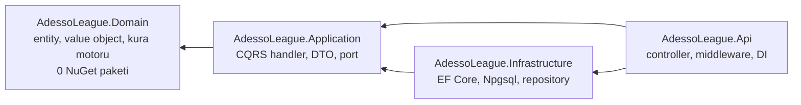

# Adesso World League — Draw Service

8 ülkeden 32 takımı, kurayla `n` gruba (`n ∈ {4, 8}`) dağıtan .NET 8 Web API. Bir grupta aynı
ülkeden iki takım bulunamaz ve yerleştirme sırası round-robin'dir: önce her grubun 1. takımı, sonra
her grubun 2. takımı. Kura sonucu, kurayı çeken kişi ve kullanılan rastgelelik tohumu (seed)
PostgreSQL'e yazılır; böylece her kura sonradan yeniden üretilebilir.

### Örnek istek

```http
POST /api/v1/draws
Content-Type: application/json

{ "groupCount": 8, "drawnBy": { "firstName": "Oğuzhan", "lastName": "Ünsal" } }
```

### Örnek yanıt (`201 Created`, `Location: /api/v1/draws/{id}`)

```json
{
  "id": "738c89ec-1507-47bf-a27d-2b0acdfd6f53",
  "groups": [
    { "groupName": "A", "teams": [ { "name": "Adesso Granada" }, { "name": "Adesso Eindhoven" },
                                   { "name": "Adesso Venedik" }, { "name": "Adesso Lisbon" } ] },
    { "groupName": "B", "teams": [ { "name": "Adesso Anvers" }, { "name": "Adesso Münih" },
                                   { "name": "Adesso Paris" }, { "name": "Adesso Porto" } ] }
  ],
  "drawnBy": { "firstName": "Oğuzhan", "lastName": "Ünsal" },
  "groupCount": 8,
  "createdAtUtc": "2026-08-03T13:44:19.8471820Z"
}
```

`groups` şeması sözleşmede sabittir. `id`, `drawnBy`, `groupCount` ve `createdAtUtc` yanında yer alan
ek alanlardır; `groups` içindeki alan adları değişmez.

---

## Hızlı başlangıç

İki komut yeterli:

```bash
docker compose up --build -d
```

```bash
start http://localhost:8080/swagger
```

Bu kadarı veritabanını ayağa kaldırır, şemayı ve sabit ülke/takım verisini migration ile oluşturur
ve API'yi `http://localhost:8080` üzerinde yayına alır. Kapatmak için `docker compose down`
(veriyi de silmek için `docker compose down -v`).

Endpoint'lerin hazır örnekleri [`requests.http`](requests.http) dosyasındadır.

### Yerelde .NET ile çalıştırma

```bash
docker compose up -d db
```

```bash
dotnet run --project src/AdessoLeague.Api
```

Gereksinimler: .NET SDK 8.0.4xx ([`global.json`](global.json) ile sabitlenmiştir) ve Docker.
Veritabanı `localhost:5433`'te yayınlanır — konteynerin içinde port 5432'dir, dışarıya 5433 açılır,
çünkü makinede kurulu bir PostgreSQL servisi 5432'yi sahiplenip konteyneri sessizce gölgeleyebilir.

```bash
dotnet test AdessoLeague.sln -c Release
```

---

## API sözleşmesi

| Metot | Yol | Yanıtlar |
|---|---|---|
| `POST` | `/api/v1/draws` | `201` + `Location` · `400` ProblemDetails · `429` |
| `GET` | `/api/v1/draws/{id}` | `200` · `404` ProblemDetails |
| `GET` | `/api/v1/draws?page=1&pageSize=20` | `200` sayfalı geçmiş · `400` |
| `GET` | `/health/live`, `/health/ready` | `200` / `503` |

Tüm hata gövdeleri RFC 7807 `application/problem+json`. Doğrulama hataları alan bazında `errors`
sözlüğünde döner:

```json
{ "title": "One or more validation errors occurred.", "status": 400,
  "instance": "/api/v1/draws", "errors": { "GroupCount": ["Group count must be one of 4, 8."] } }
```

`POST /api/v1/draws` dakikada 30 istekle sınırlıdır (sabit pencere); aşıldığında `429` döner.

---

## Mimari

Clean Architecture, 4 katman. Bağımlılık oku daima içeri doğrudur; `Domain` hiçbir projeye referans
vermez ve içinde tek bir NuGet paketi yoktur.



`Application` yalnızca port arayüzleri tanımlar (`IDrawRepository`, `IDrawQueries`,
`ITeamRepository`, `IUnitOfWork`); bunları `Infrastructure` gerçekler. Böylece EF Core hiçbir zaman
`Application`'a sızmaz.

```
src/
  AdessoLeague.Domain/
    Common/          Result, Result<T>, Error, ValidationError
    ValueObjects/    GroupCount, GroupName, DrawnBy
    Leagues/         Country, Team
    Draws/           Draw (aggregate root), DrawGroup, DrawGroupTeam
      Engine/        IDrawStrategy, BacktrackingRoundRobinStrategy, IDrawRule,
                     OneTeamPerCountryRule, IRandomProvider, DrawEngine, DrawRequest
  AdessoLeague.Application/
    Abstractions/Persistence/   port arayüzleri
    Behaviors/                  ValidationBehavior, LoggingBehavior
    Contracts/                  DrawResponse, GroupResponse, TeamResponse, PagedList<T>
    Features/Draws/             CreateDraw, GetDrawById, GetDraws
    Mapping/                    elle yazılmış ToResponse()
    Options/                    DrawOptions + IValidateOptions
  AdessoLeague.Infrastructure/
    Persistence/                LeagueDbContext, Configurations, Converters, Migrations, Seed
    Repositories/               DrawRepository (yazma), DrawQueries (okuma), TeamRepository
    Randomization/              SeededRandomProvider
  AdessoLeague.Api/
    Controllers/                DrawsController
    Contracts/Requests/         API istek modelleri
    Middleware/                 CorrelationIdMiddleware
    Handlers/                   GlobalExceptionHandler
    HealthChecks/, RateLimiting/, Swagger/, Extensions/
tests/
  AdessoLeague.UnitTests/
  AdessoLeague.IntegrationTests/
```

Mimari kararların gerekçeleri: [ADR 0001](docs/adr/0001-clean-architecture-with-cqrs.md),
[ADR 0002](docs/adr/0002-backtracking-draw-algorithm.md),
[ADR 0003](docs/adr/0003-postgresql-with-ef-core.md).

---

## Kura algoritması ve neden backtracking

Bu projenin can alıcı noktası burasıdır.

### İstenen yerleştirme sırası

Kura sütun sütun değil, **satır satır** ilerler:

```
flatIndex = 0 .. 31
grup      = flatIndex % n          slot = flatIndex / n

n=8 için:  A1 B1 C1 D1 E1 F1 G1 H1   →   A2 B2 C2 D2 E2 F2 G2 H2   →   ...
```

Her adımda havuzdan, o gruba **uygun** takımlar arasından rastgele biri seçilir. Tek kısıt
`OneTeamPerCountryRule`: bir grupta aynı ülkeden ikinci takım olamaz.

### Naif yaklaşımın sorunu — ölçüm

"Uygun adaylar arasından rastgele seç, asla geri dönme" yaklaşımı **çıkmaza girer**: son turlarda
bir grup için havuzda uygun takım kalmaz. Bu depoda ölçüldü — 20.000 deneme, seed 0..19999,
her denemede yukarıdaki sıra ve kısıt aynen uygulandı:

| Yaklaşım | n=4 | n=8 |
|---|---|---|
| Naif greedy (geri dönüş yok) | **0 / 20.000** (%0,000) | **5.850 / 20.000** (%29,250) |
| Backtracking (bu depodaki motor) | 0 / 20.000 (%0,000) | 0 / 20.000 (%0,000) |

Yani `n=8` için naif yaklaşım denemelerin yaklaşık **her üçte birinde** geçerli bir kura üretemez.
`n=4`'te çıkmaz gözlenmedi — bu beklenen bir sonuç, çünkü `n=4`'te her grup 8 takım alır ve 8 ülke
vardır; her grup ülkelerin tam bir permütasyonudur, kısıt çok daha gevşektir. Yine de `n=4` için
"çıkmaz imkânsızdır" demek bu ölçümün söyleyebileceğinden fazlasıdır.

> Ölçümü üreten kod depoda tutulmadı; tek kullanımlık bir harness'tı. Yukarıdaki iki satır aynı
> havuz, aynı kısıt ve aynı seed aralığıyla üretildi.

### Çözüm: randomized backtracking

`BacktrackingRoundRobinStrategy` sırayı bozmadan çıkmazı ortadan kaldırır:

```
TryFill(flatIndex):
    flatIndex == 32 ise başarı
    grup      = flatIndex % n
    adaylar   = havuzdaki, tüm IDrawRule'ları geçen takımlar
    adayları  IRandomProvider ile karıştır
    her aday için:
        yerleştir
        TryFill(flatIndex + 1) başarılıysa başarı
        yerleştirmeyi geri al          ← backtracking
    başarısız (bu dal çıkmaz)
```

Üç özellik korunur:

- **Sıra bozulmaz.** `flatIndex` daima 0'dan 31'e ilerler; geri alma yalnızca son yerleştirmeyi
  iptal eder, farklı bir sıraya geçmez.
- **Rastgelelik kaybolmaz.** Adaylar her düğümde yeniden karıştırılır; backtracking sadece geçersiz
  dalları eler, tercihleri yönlendirmez.
- **Başarısızlık imkânsızdır.** Arama uzayı sonlu ve tüketilebilir olduğu için geçerli bir dağılım
  varsa mutlaka bulunur. Ölçümde 40.000 kuranın hiçbiri başarısız olmadı; kura başına maliyet
  ~0,1 ms.

Alternatif "başarısız olursa baştan başla" yaklaşımı da çalışırdı, ama en kötü durum süresi
sınırsızdır. Gerekçe: [ADR 0002](docs/adr/0002-backtracking-draw-algorithm.md).

### Yeniden üretilebilirlik

`IRandomProvider` her kura için bir seed taşır ve bu seed `draws.seed` kolonuna yazılır. Rastgelelik
`new Random()` ile değil enjekte edilen sağlayıcı üzerinden gelir; aynı seed + aynı `n` + aynı havuz
her zaman aynı takım dağılımını verir. Bu, testlerde determinizmi ve üretimde denetlenebilirliği
sağlar.

Bir sınır: yeniden üretilebilen şey **takım dağılımıdır**, saklanan satır kimlikleri değil.
`DrawGroup` ve `DrawGroupTeam` kimlikleri `Guid.NewGuid()` ile üretilir.

### Motorun kendi çıktısını doğrulaması

`DrawEngine`, stratejinin döndürdüğü sonucu veritabanına gitmeden önce 7 invariant için yeniden
denetler (32 takım, tekrar yok, ülke çakışması yok, grup sayısı ve boyutu, grup adları, round-robin
pozisyonları). Bir strateji hatası API'ye `Draw.InvariantViolated` olarak döner, sessizce kaydedilmez.

---

## Kullanılan design pattern'ler

| Pattern | Nerede | Neden |
|---|---|---|
| CQRS | `Application/Features/**` | Yazma aggregate üzerinden, okuma doğrudan projeksiyonla; iki tarafın modeli farklı |
| Mediator | MediatR 12.5.0 | Controller ile handler arasında gevşek bağ; controller yalnızca `ISender.Send` çağırır |
| Pipeline / Decorator | `ValidationBehavior`, `LoggingBehavior` | Doğrulama ve loglama handler'lara sızmaz; geçersiz komut handler'a hiç ulaşmaz |
| Strategy | `IDrawStrategy` → `BacktrackingRoundRobinStrategy` | Algoritma değiştirilebilir ve izole test edilebilir |
| Specification / Rule | `IDrawRule` → `OneTeamPerCountryRule` | Yeni kural eklemek algoritmayı değiştirmez |
| Result | `Result`, `Result<T>`, `Error` | Akış kontrolü için exception atılmaz; hata tipi HTTP koduna maplanır |
| Repository + Unit of Work | `IDrawRepository`, `IDrawQueries`, `IUnitOfWork` | Persistence detayı `Application`'a sızmaz; kayıt tek transaction |
| Factory | `Draw.Create`, `Country.Create` | Aggregate kurulum kuralları tek yerde; grupları boş olarak kurar |
| Options | `DrawOptions` + `IValidateOptions` | Sayfalama ve rate limit sabitleri koddan çıkarıldı, açılışta doğrulanır |
| Provider (port) | `IRandomProvider`, `TimeProvider` | Rastgelelik ve saat enjekte edilir; domain ortam durumu okumaz |

---

## Veri modeli

PostgreSQL 16, EF Core 8 + Npgsql 8, şema `snake_case` (EFCore.NamingConventions).

```
countries(id, name)                                   name unique
teams(id, country_id → countries, name)               name unique
draws(id, drawn_by_first_name, drawn_by_last_name,
      group_count, seed, created_at_utc)              created_at_utc timestamptz (UTC)
draw_groups(id, draw_id → draws, name, ordinal)       unique(draw_id, name)
draw_group_teams(id, draw_group_id → draw_groups,
                 draw_id → draws,
                 team_id → teams, position)           unique(draw_group_id, team_id)
                                                      unique(draw_id, team_id)
```

- `unique(draw_id, name)` — bir kurada aynı grup adı iki kez olamaz.
- `unique(draw_group_id, team_id)` — bir takım aynı gruba iki kez yerleşemez.
- `unique(draw_id, team_id)` — bir takım aynı kurada iki farklı gruba yerleşemez. Bu indeksin
  kurulabilmesi için `draw_group_teams` tablosu `draw_id`'yi denormalize olarak taşır; aksi halde
  bu kural yalnızca uygulama katmanında kalırdı.
- `position` grup içinde 1 tabanlıdır ve kuranın ürettiği sırayı kaydeder; `ordinal` grup sırasıdır
  ve 0 tabanlıdır ("A" = 0).

Ülke ve takım verisi `HasData` ile ilk migration'da seed edilir; kimlikler 1 tabanlı sıra
numaralarından türetildiği için her makinede aynıdır ve sonraki migration'lar bu satırları
değiştirmez. Çalışma anında havuz koddan değil **veritabanından** okunur.

Migration dosyaları elle düzenlenmez; `dotnet ef migrations add <Ad>` ile üretilir.

---

## Test stratejisi

`dotnet test` — **292 test** (279 birim + 13 integration), ~15 sn. Integration testleri Docker
gerektirir; Testcontainers kendi PostgreSQL konteynerini kaldırır, ayrıca kurulum gerekmez.

**Kura motoru — invariant + fuzz.** `n=4` ve `n=8` için 10.000 seed (toplam **20.000 kura**), her
sonuçta 7 invariant doğrulanır:

1. Yerleşen takım sayısı 32
2. Takım tekrarı yok, havuzun tamamı kullanılmış
3. Hiçbir grupta aynı ülkeden iki takım yok
4. Grup sayısı `n`, her grubun boyutu `32/n`
5. Grup adları "A"dan başlayarak boşluksuz
6. `position` alanları grup içinde 1..`32/n`
7. `n=4` ise her grupta 8 ülkenin hepsi tam birer kez

10.000 seed xUnit'e 10.000 ayrı vaka olarak verilseydi koşu süresinin yarısı test altyapısı yüküne
giderdi; bu yüzden theory 100 vaka × 100 seed olarak bölündü — kapsam aynı, süre yarıya indi.

Fuzz koşumunun boş olmadığı mutasyonla doğrulandı: `OneTeamPerCountryRule` geçici olarak her zaman
`true` döndürecek şekilde değiştirildiğinde 202 motor testinin tamamı kırmızıya döndü.

**Determinizm.** Aynı seed aynı dağılımı üretiyor mu, farklı seed'ler farklı dağılım veriyor mu —
ikisi de test edilir.

**Application.** Handler'lar elle yazılmış fake repository'lerle test edilir. `ValidationBehavior`
için ayrıca gerçek bir DI konteyneri kurulur ve `ISender` üzerinden geçersiz bir komut gönderilir:
handler'a hiç ulaşmadığı ve repository'ye kayıt düşmediği doğrulanır.

**Domain.** Value object'ler (`GroupCount`, `GroupName`, `DrawnBy`) ve `Draw` aggregate'inin
yerleştirme kuralları ayrı ayrı test edilir.

**Integration — gerçek PostgreSQL üzerinde uçtan uca.** `Testcontainers.PostgreSql` ile ayağa kalkan
bir konteyner ve `WebApplicationFactory<Program>` üzerinden 13 senaryo: `n=8` ve `n=4` için kayıt,
geçersiz `groupCount` (5, 0, -1), boş isim, `drawnBy` ve `seed`'in gerçekten yazılması,
`Location`'dan geri okuma, bilinmeyen id için 404, geçmişin `createdAtUtc` azalan sıralanması,
**10 eşzamanlı istek** (10 ayrı kura, 320 yerleşim satırı) ve yanıt şemasının `groups[].groupName` /
`groups[].teams[].name` alanlarını ham JSON üzerinden doğrulaması.

Doğrulamalar yalnızca HTTP yanıtına değil **veritabanına** da bakar: satır sayıları ve
`drawn_by_first_name` / `seed` kolonları ham SQL ile okunur. Saklanan seed'in anlamlı olduğu da
test edilir — aynı seed ile kura yeniden oynatıldığında birebir aynı grup dizilimi çıkmalıdır.

Testler tek bir konteyneri paylaşır ve her testin başında `TRUNCATE draws CASCADE` çalışır;
seed'lenmiş `countries`/`teams` satırları korunur. `dotnet test` arka arkaya iki kez koşturularak
izolasyon doğrulandı — ikinci koşumda da 292/292 yeşil.

**Elle doğrulanan.** Ayrıca her adımın sonunda API canlı çalıştırılıp `curl` ile denendi: `n=8`/`n=4`
yanıt şeması, `n=5` ve boş isim için 400, `Location` başlığından geri okuma, POST ve GET
yanıtlarının `groups` bölümünün baytı baytına aynı olması, okuma sorgularının SQL sayısı
(`GET /draws/{id}` → 1 sorgu, `GET /draws` → 2 sorgu), rate limit (35 istek → 30×201 + 5×429),
health endpoint'leri, correlation id'nin log'a ve yanıt başlığına düşmesi, beklenmedik hatada
Development'ta stack trace'in görünüp Production'da görünmemesi.

---

## Bilinçli kapsam dışı bırakılanlar

Aşağıdakiler istenmedi ve bilerek yapılmadı. Her biri için gerekçe ve gerekseydi izlenecek yol:

| Konu | Neden yapılmadı | Gerekseydi |
|---|---|---|
| **AutoMapper** | Tek bir yanıt tipi var; mapping 40 satır ve derleme zamanında denetleniyor. Bir mapping kütüphanesi çalışma zamanı hatası ve konfigürasyon yükü ekler | Mapping sayısı arttığında `Mapperly` gibi kaynak üreteçli bir çözüm; çalışma zamanı yansıması yok |
| **Kimlik doğrulama / yetkilendirme** | İstenmedi; kura herkese açık bir okuma-yazma işlemi olarak tanımlandı | `AddAuthentication().AddJwtBearer()` + `POST /draws` üzerinde `[Authorize]`; `drawnBy` gövdeden değil token claim'inden alınırdı |
| **Önbellek** | Kura geçmişi küçük; `GET /draws/{id}` birincil anahtar üzerinden tek sorgu, liste ise sayım + sayfa olmak üzere iki sorgu. Ölçülmemiş bir darboğaz için karmaşıklık eklenmedi | `IDistributedCache` + Redis; `GET /draws/{id}` değişmez bir kaynak olduğu için `ETag`/`Cache-Control` de yeterdi |
| **Mikroservis / mesajlaşma** | Tek bir sınırlı bağlam, tek veritabanı. Bölmek dağıtık transaction sorununu bedavaya satın almak olurdu | Kura sonucu başka sistemleri tetikleseydi transactional outbox + bir broker |
| **Outbox pattern** | Dışarıya yayınlanan bir olay yok; kayıt tek transaction'da tamamlanıyor | `draws` ile aynı transaction'da `outbox_messages` tablosu ve ayrı bir dispatcher |
| **Event sourcing** | Kura değişmez bir kayıt; durum geçmişi yok, sadece sonuç var. Seed zaten yeniden üretilebilirliği sağlıyor | Kuranın sonradan düzeltilmesi gerekseydi olay akışı anlamlı olurdu |
| **Admin CRUD (ülke/takım)** | Havuz sabit: 8 ülke × 4 takım. Değişebilir olsaydı 32 takım varsayımını koruyan yeni kurallar gerekirdi | Ayrı bir `LeagueController` + havuz boyutunu doğrulayan bir invariant |
| **Çok dillilik** | API sözleşmesi tek dilli; hata mesajları geliştiriciye yönelik | FluentValidation'ın `IStringLocalizer` desteği + `Accept-Language` |

---

## Sürüm kararları

Tüm paket sürümleri [`Directory.Packages.props`](Directory.Packages.props) içinde **merkezî olarak**
sabitlenmiştir (central package management); hiçbir `.csproj` sürüm numarası taşımaz. Ortak derleme
ayarları [`Directory.Build.props`](Directory.Build.props) içindedir: `net8.0`, C# 12, nullable açık,
`TreatWarningsAsErrors` açık.

| Karar | Gerekçe |
|---|---|
| **.NET 8 (LTS)** | Uzun destekli sürüm; üretim hedefi olan bir servis için STS sürümlerin destek penceresi kısa. `LangVersion` 12'de sabit, C# 13 özelliği kullanılmıyor |
| **MediatR 12.5.0'da sabit** | 13.x ticari lisansa geçti. Sürüm merkezî olarak dondurulmuştur; `dotnet add package` ile yükseltilmemelidir |
| **EF Core 8 + Npgsql 8** | Hedef framework `net8.0`; 9.x paketleri `net9.0` gerektirir. EF/Npgsql/Design/NamingConventions aynı ana sürüm ailesinde tutulur |
| **FluentAssertions 6.12.2** | 7.x ve sonrası ticari lisansa geçti |
| **Testcontainers 3.x** | Integration testleri için hazır; CI'da ek servis tanımı gerektirmez |

`.editorconfig` kaynak dosyalar için CRLF ister; [`.gitattributes`](.gitattributes) bunu checkout
seviyesinde sabitler, aksi halde Linux CI'da `dotnet format --verify-no-changes` adımı kırmızıya
dönerdi. Shell script'leri ve Docker/YAML dosyaları LF kalır.

---

## Sürüm yönetimi

Tüm NuGet sürümleri kök dizindeki [`Directory.Packages.props`](Directory.Packages.props)
içinde merkezî olarak sabitlenmiştir (central package management). Ortak derleme ayarları
(`net8.0`, C# 12, nullable, warnings-as-errors) [`Directory.Build.props`](Directory.Build.props)
içindedir.
